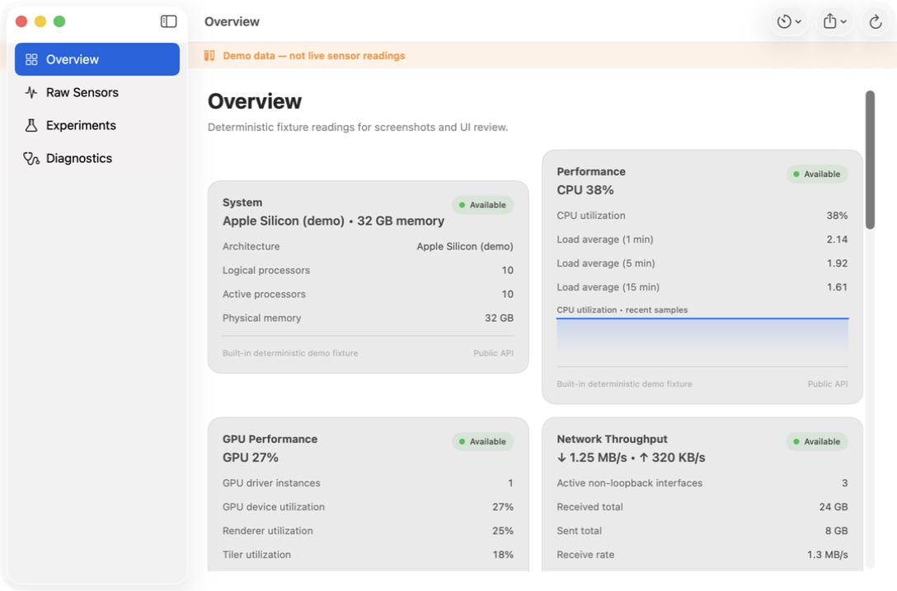

# Mac Sensor Lab

[简体中文](README.md) | English

> Working title. A fact-first, native, extensible sensor and system telemetry lab for macOS.

- Status: active development
- Platform: macOS 14 or later
- License: MIT; third-party notices remain under their original licenses
- Privacy: local-only by default; no tracking or off-device collection

## Preview



This screenshot uses the visibly labeled, deterministic `--demo` fixtures. It does not contain
readings or identifiers from the development Mac.

## Why this project exists

macOS exposes useful hardware and operating-system telemetry through a mixture of public APIs,
IOKit registries, HID reports, and undocumented interfaces. Existing tools often either hide the
raw channels or present internal values without enough provenance.

Mac Sensor Lab is designed around a stricter contract:

- preserve raw channels, units, source, timestamp, capability level, and failure status;
- label derived and estimated values instead of presenting them as hardware facts;
- show a native SwiftUI shell immediately while independent providers load in the background;
- degrade safely when a sensor is absent, busy, unsupported, or permission-gated;
- never require the main app to run as root or silently request protected access;
- keep exports reviewable and free of machine-unique identifiers.

## Current capabilities

The current build has 14 providers:

| Area | Current data | Boundary |
|---|---|---|
| System | architecture, processor counts, memory, macOS version, uptime | Public `ProcessInfo`; no hardware UUID or host/user name |
| Performance | aggregate CPU utilization, load averages, Mach memory categories, swap | No process list |
| GPU | allowlisted AGX device/renderer/tiler utilization and memory counters | Undocumented fixed keys; no registry identity fields |
| Network | aggregate active-interface bytes, packet rates, and throughput | No interface names, addresses, SSID, BSSID, or MAC address |
| Battery | charge, source, charging state, cycles, electrical data, temperature, capacities, valid time estimates | Fixed non-identifying AppleSmartBattery key allowlist |
| Thermal | public thermal pressure and Low Power Mode | A pressure state is not a temperature |
| SMC | allowlisted temperatures, fan RPM, and internal power channels | Read-only client; no key writes or fan control |
| Display | active display count, logical resolution, refresh rate | Public CoreGraphics data |
| Storage | system-volume capacity and free/used space | No paths in exports |
| Disk activity | aggregate bytes, operations, rates, and driver errors | No device name, serial, volume name, mount point, or file path |
| SPU discovery | presence of known motion and ambient-light sensor types | Presence does not imply a live data stream |
| SPU live | best-effort acceleration, level, angular velocity, raw ambient intensity, and four spectral channels | Reads only reports already published by macOS; never writes driver state |
| Lid angle | opening-angle HID feature report | Undocumented and model-dependent |
| Experimental hardware | Apple SPU, AppleSMC, and Force Touch presence | Detection only; it cannot unlock a measurement experiment by itself |

The Overview, Raw Sensors, Experiments, and Diagnostics screens share the same normalized
`SensorSnapshot` and `SensorChannel` model.

## Sampling, experiments, and export

- Choose a 1, 2, 5, or 10 second automatic interval, pause/resume, refresh manually, or clear the
  in-memory chart history.
- The interval is remembered in this app's preferences. Pause state intentionally resets at launch.
- Chart history is capped at 600 distinct timestamps per channel.
- Export a current JSON snapshot or channel-oriented CSV file after choosing a destination.
- Start an explicit continuous CSV recording with separate `raw_value` and `formatted_value`
  columns, spreadsheet-formula protection for text fields, per-batch synchronization,
  actor-isolated duplicate suppression, a fresh end-of-file/size check before every batch, full
  batch-size preflight followed by row-at-a-time encoding/writes, and a 50 MB hard limit.
- Search Raw Sensors by provider, channel, source, status, or stable ID without mutating sampling,
  history, or export data.
- Use rolling raw ambient-light statistics. A lux value appears only after an explicit one-point
  external reference and remains labeled `Estimated`.
- Import or export a portable light-calibration JSON file containing only the two reference values
  and capture time. Imports are local files capped at 64 KiB; invalid or oversized input cannot
  replace the current calibration.
- Capture a local lid-angle reference and view signed relative opening/closing change.
- Inspect value-free sampling health counters for completed cycles, latest duration, provider
  status transitions, and consecutive issue samples. An explicitly exported privacy-safe support
  report may include those counters and stable channel metadata, but no readings, summaries, notes,
  source strings, snapshot timestamps, machine identifiers, or file paths.
- Diagnostics keeps permission-required, unavailable, error, limited, and loading counts separate.
  Live providers may attempt ordinary read-only access during sampling; denial is reported without
  administrator escalation, driver changes, or a privacy-control bypass.

Nothing records automatically, and the app contains no upload client.

## Deterministic demo mode

Demo mode is intended for screenshots, UI reviews, and machines without the same sensor set:

```bash
open "outputs/Mac Sensor Lab.app" --args --demo
```

It supplies 14 built-in, finite, identity-free provider fixtures. A persistent orange banner and the
Diagnostics screen identify the data as synthetic. Demo sampling, light-calibration, and lid-angle
reference preferences use separate keys, so they do not change live-mode preferences.

The probe CLI also accepts `--demo`. Add `--diagnostics` to output only the privacy-safe provider
metadata report; without options it retains the original live, full-snapshot behavior.
Diagnostics export refuses invalid, duplicate, or identifying provider/channel IDs instead of
creating a report that violates its privacy-safe contract.

`sensorlab-selftest` applies a reusable structural contract audit to registered metadata and live
snapshots. It checks stable and unique provider/channel IDs, registry metadata consistency, finite
numeric values, bounded nonblank display metadata, provider/channel/note cardinality, status/channel
consistency, future timestamps, and identifying field names that must never become IDs. The audit
does not match free-text summaries or notes against privacy keywords and does not collect additional
data.

## Build and test

Xcode must have completed its first-launch setup. The project never invokes `sudo` itself.

```bash
swift build
swift test
swift run sensorlab-selftest --portable
swift run sensorlab-selftest
swift run sensorlab-selftest --spu-stability
swift run sensorlab-probe
swift run sensorlab-probe -- --demo
swift run sensorlab-probe -- --diagnostics
./scripts/build-app.sh
./scripts/release-audit.sh
open "outputs/Mac Sensor Lab.app"
```

`scripts/build-app.sh` assembles and ad-hoc signs a local app bundle, validates `Info.plist`, and
packages and validates `PrivacyInfo.xcprivacy`. It does not change the globally selected developer
directory.

`scripts/release-audit.sh` examines only tracked files and release resources in this repository. It
rejects tracked build output, absolute user paths, common secret signatures, protected permission
keys that this release does not implement, forbidden mutation/privilege APIs, missing release
documents, or a privacy manifest inconsistent with the current offline behavior.

GitHub Actions repeats formatting, audit, build, 39 XCTest cases, portable self-test, and app-bundle
assembly on `macos-26`.

## Repository layout

```text
.
├── Sources/
│   ├── SensorCore/       provider, model, export, recording, and fixture code
│   ├── MacSensorLab/     native SwiftUI app
│   ├── SensorLabProbe/   JSON probe CLI
│   └── SensorLabSelfTest/
├── Tests/
├── Resources/            Info.plist, icon, and privacy manifest
├── docs/                 product, privacy, architecture, and release notes (Chinese)
├── references/           pinned upstream research ledger
├── LICENSES/             third-party license texts
├── scripts/
├── outputs/              local app bundles; ignored by Git
└── .work/                temporary upstream/build analysis; ignored by Git
```

## Safety and privacy invariants

This release does not:

- run the app as root, install a privileged helper, or bypass macOS authorization;
- write Apple SPU driver state or SMC keys, control fans, or change system settings;
- request microphone, camera, location, Accessibility, Input Monitoring, or Full Disk Access;
- collect serial numbers, hardware UUIDs, provisioning UDIDs, user/host names, network identifiers,
  precise location, process/window lists, or audio recordings;
- start a long-running recording without an explicit user action;
- claim that raw ambient channels are lux or that internal component temperatures are room
  temperature.

`PrivacyInfo.xcprivacy` declares no tracking, tracking domains, collected-data types, or
required-reason API use for this macOS-only build. Any future permission, platform, telemetry, or
network expansion requires a new design and privacy review.

## Known limits

- Undocumented HID, SMC, and AGX keys can change between macOS releases and Mac generations.
- Only one current Apple Silicon Mac has received full hardware regression testing so far.
- Virtual interfaces and tunnels can cause aggregate network traffic to count the same bytes on
  multiple paths; the chart is a trend, not ISP billing data.
- Battery capacity ratio is controller-reported full-charge capacity divided by design capacity. It
  can exceed 100% and is not Apple's Battery Health status.
- One-point light calibration assumes zero offset and is not certified photometry.
- Acceleration and gyroscope channels remain unavailable when macOS does not publish reports; this
  build does not force the driver awake.
- Force Touch raw pressure and microphone analysis are not implemented in the current build.
- Developer ID signing, hardened-runtime compatibility, notarization, and an App Sandbox policy are
  still required before distributing a downloadable binary.

## Contributing

Read [CONTRIBUTING.md](CONTRIBUTING.md), [SECURITY.md](SECURITY.md), and
[THIRD_PARTY_NOTICES.md](THIRD_PARTY_NOTICES.md) before adding a provider. New data sources must use
stable non-identifying IDs, document units and provenance, define unsupported/timeout behavior, and
include fixture tests. Hardware presence alone must never be treated as a live measurement source.
Cross-model evidence should use the repository's privacy-safe compatibility form and the workflow
in [docs/06-匿名兼容性贡献指南.md](docs/06-匿名兼容性贡献指南.md); never attach full snapshots,
recordings, system dumps, or real-reading screenshots to a public issue.

## License

Original project code and artwork are MIT licensed. Adapted or referenced upstream work remains
subject to the license and attribution recorded in [THIRD_PARTY_NOTICES.md](THIRD_PARTY_NOTICES.md),
[LICENSES](LICENSES), and [references/upstreams.md](references/upstreams.md).
